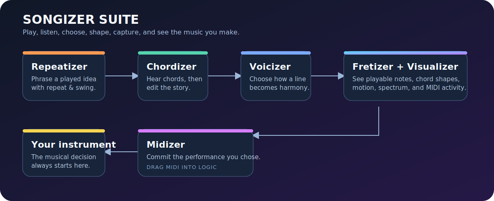
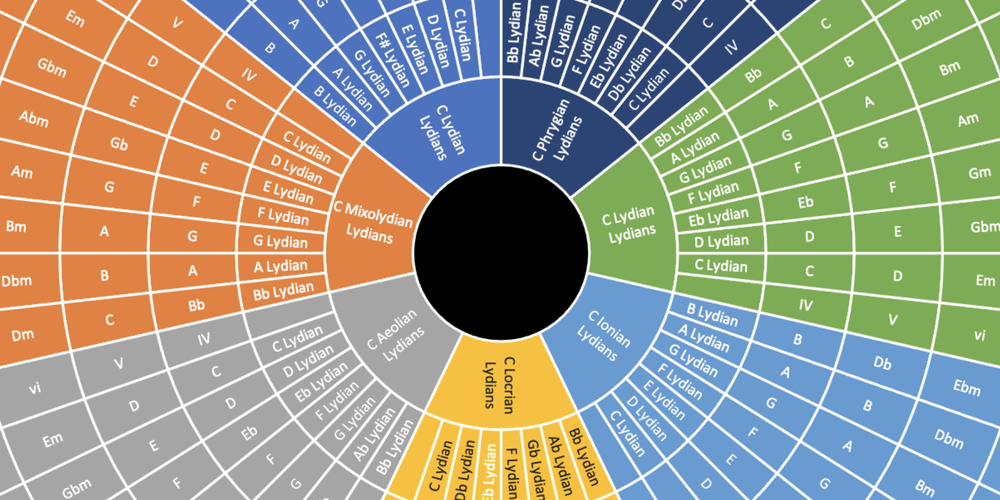
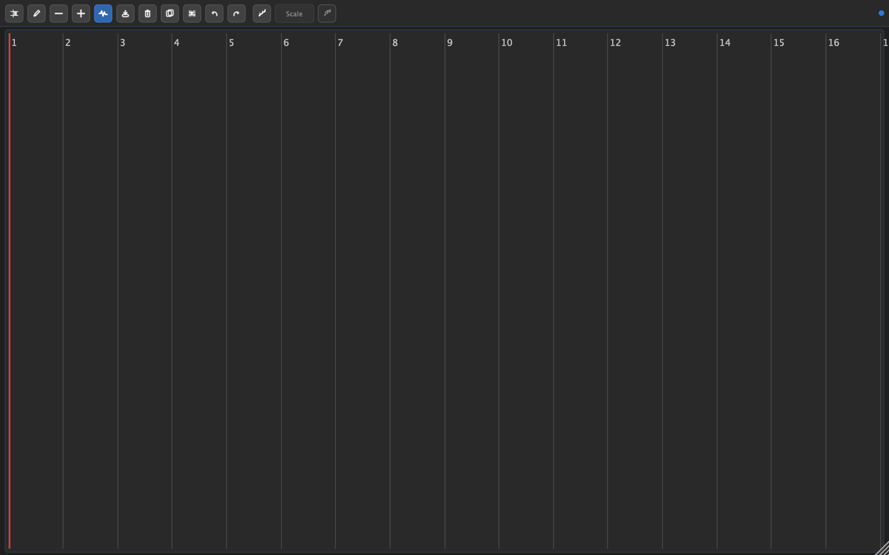
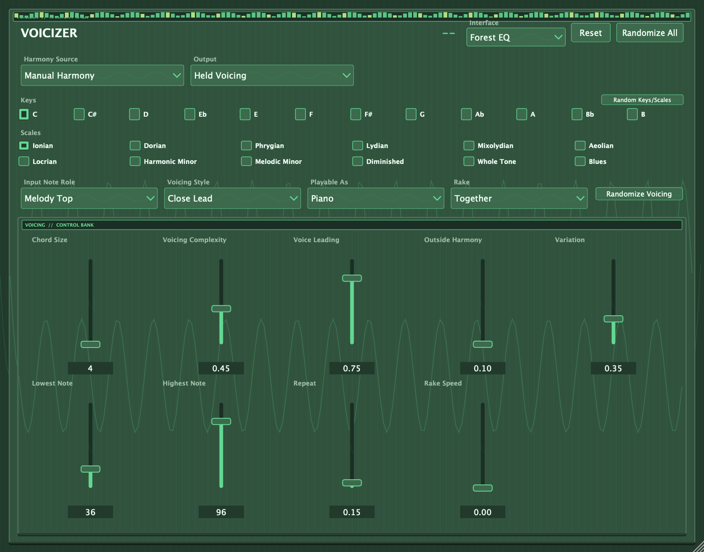
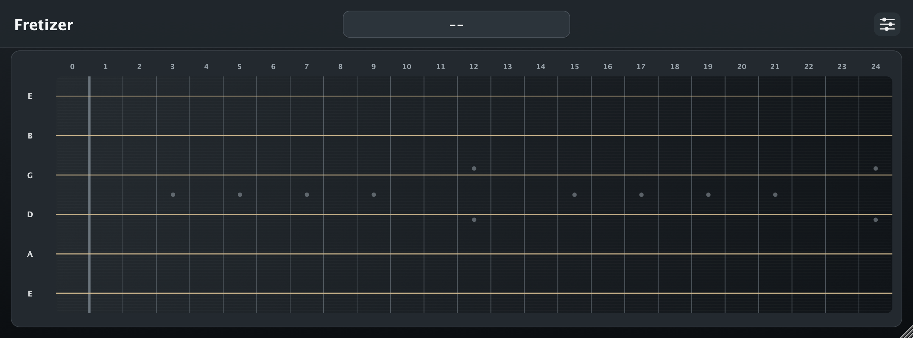
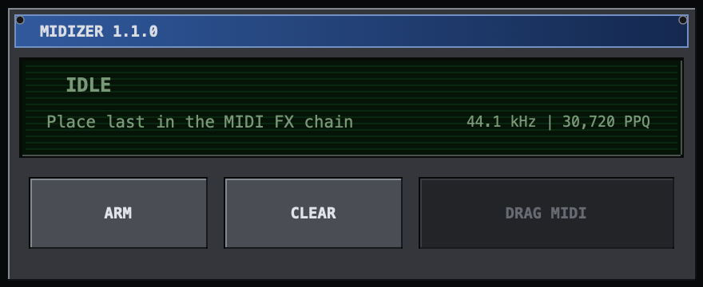
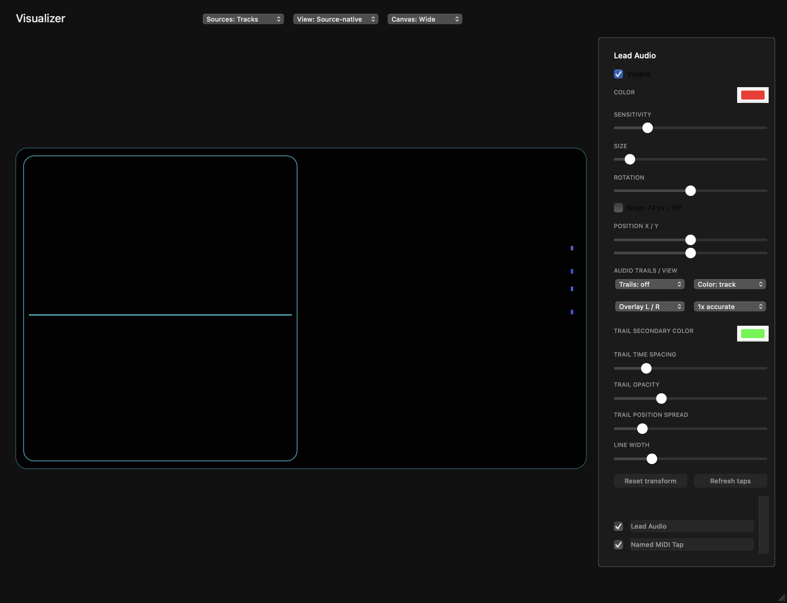

# Songizer Suite

Songizer Suite is a unified set of six Logic Pro music tools for shaping, understanding, capturing, and visualizing performances. Version 2.0.2 keeps the canonical 2.0 suite intact while updating Repeatizer to 2.0.2 and Voicizer to 2.0.5, alongside the tested Visualizer 2.0.4 release.

## Easy installation

Download **`Songizer-Suite-2.0.2-macOS.dmg`** from the [latest release](https://github.com/santismo/songizer/releases/latest), open it, and double-click **Install Songizer Suite.command**.

1. Quit Logic Pro.
2. Open the DMG.
3. Double-click **Install Songizer Suite.command**.
4. Restart Logic Pro.

The installer installs all six Audio Units together. Existing Songizer development copies are moved—not deleted—to a timestamped folder under `~/Library/Application Support/Songizer/Development Archive`.

## Included tools

| Tool | Version | What it contributes | Logic placement |
| --- | --- | --- | --- |
| [Repeatizer](https://github.com/santismo/repeatizer) | 2.0.2 | Full pad and Instrument modes for repeats, patterns, chord rhythm, arpeggiation, swing, and tempo performance, with gate-safe live Tempo CC changes. | MIDI FX |
| [Chordizer](https://github.com/santismo/chordizer) | 2.0.0 | Chord regions, scale transformation, harmonization, and register-consistent harmonic mapping. | MIDI FX |
| [Voicizer](https://github.com/santismo/LeadVoicer) | 2.0.5 | Scale-aware voicing styles, selected-mode interchange, full piano range, and a root-independent probability-weighted Chord Bank. | MIDI FX |
| [Fretizer](https://github.com/santismo/fretizer) | 2.0.0 | Guitar-fretboard visualization that preserves incoming MIDI unchanged. | MIDI FX |
| [Midizer](https://github.com/santismo/midizer) | 2.0.0 | Transport-aware capture and export of the final processed MIDI performance. | MIDI FX, last in a capture chain |
| [Visualizer](https://github.com/santismo/visualizer-studio) | 2.0.4 | Resizable source-native audio and MIDI visualization with named taps, repaired MIDI-only transport, per-source transforms, colors, scope trails, and history controls. | Audio FX / MIDI FX |

Detailed component placement is in [the suite contents guide](docs/SUITE-CONTENTS.md). Exact bundle identities and checksums are recorded in the release manifest included with each release.

## Plug-in interfaces

### Repeatizer

Repeatizer can work as a pad-based rhythm processor or in Instrument mode. Instrument mode turns held notes into timed chord patterns and arpeggios while retaining the complete repeat, style, pattern, variation, dynamics, and tempo-control system.
Live Tempo CC changes now keep existing note gates aligned with the retimed repeat grid, preventing overlapping held notes.

### Chordizer

Chordizer keeps transformed notes near the register being played and uses middle C as the common harmonic reference for scale and harmony performance.

### Voicizer

Voicizer includes direct scale chords, arranged voicing styles, and Chord Bank mode. Multiple scales under one key now form a modal-interchange palette without requiring Outside or Modulation, and Piano/Piano Hands can span A0–C8. Chord Bank learns qualities such as `m9` independently of their captured root, then applies those formulas to incoming notes according to Input Note Role.

### Fretizer

Fretizer provides the suite’s fretboard view and retains its optional visual themes while using the shared Songizer control language.

### Midizer

Midizer records the post-processing MIDI stream against Logic’s transport and exports it for editing. Put it after Chordizer, Voicizer, Repeatizer, and any other note-changing MIDI effects when you want the complete result captured.

### Visualizer

Visualizer combines an Audio Source, MIDI Source, and resizable master display in one component. Each tap can be named in its compact instance window and then shown, hidden, selected, positioned, rotated, sized, and colored independently. Audio views include configurable oscilloscope modes and trails; MIDI views include per-note and gradient color systems. The refreshed source registry keeps MIDI-only transport moving without requiring an Audio Source tap.

## Suggested Logic Pro placements

| Goal | Suggested chain | Why |
| --- | --- | --- |
| Pattern a played harmony | Repeatizer → Voicizer → Fretizer | Shape the rhythm, choose the voicing, then inspect guitar playability. |
| Perform from chord movement | Chordizer → Voicizer | Establish harmonic context, then play role-aware voicings. |
| Capture the finished MIDI phrase | Chordizer / Voicizer / Repeatizer → Midizer → Instrument | Midizer records the final transformed notes without changing them. |
| Keep guitar MIDI visible and unchanged | Fretizer | Display notes and shapes without rewriting MIDI. |
| See a session | Visualizer MIDI Source on MIDI tracks; Visualizer Audio Source on audio tracks; Visualizer on Stereo Out | The master view discovers and displays the active sources. |

Logic routes MIDI FX in order. Each Songizer plug-in also works independently; there is no required chain.

## Compatibility and source

Songizer Suite 2.0.2 is for macOS and Logic Pro hosts that support Audio Units and MIDI FX. The DMG contains signed Audio Unit bundles, Repeatizer's invisible AUv3 container, and a recoverable installer. Source and licensing details remain available in the linked product repositories.

The suite documentation and installer are MIT licensed. The release does not include Logic Pro, instruments, or sound content.
